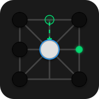
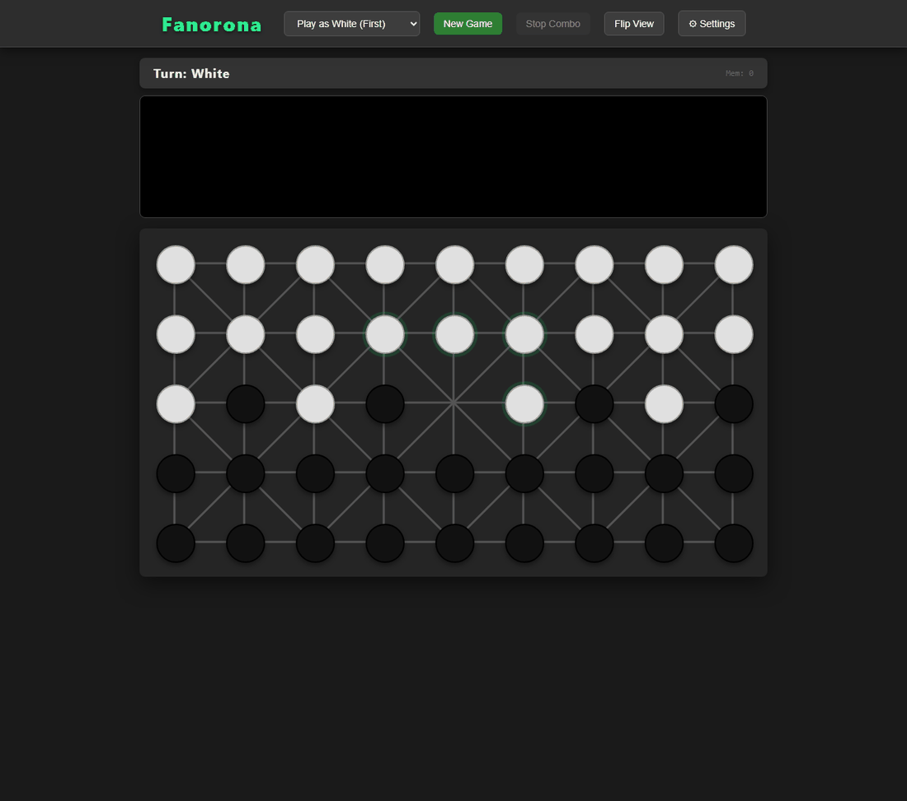

<div align="center">



# Fanorona

A brute-force Fanorona engine and web UI, built to be unbeatable by the AI in
*Assassin's Creed III / Rogue / Liberation* — with an optional mode where it just talks trash instead.

### [▶ Play it in your browser](https://slimplanet92805.github.io/Fanorona/)

No download, no server — the engine is compiled to WebAssembly and runs on your machine.

[](LICENSE.txt)




</div>

## Why this exists

Fanorona is the Malagasy board game that shows up as a minigame in a few
*Assassin's Creed* titles. I couldn't beat the in-game AI, went looking for a
web version to practice against, and found the available ones were even
weaker. So the goal became: build something that can't lose.

The first attempt trained a reinforcement-learning model — cool in theory,
but slow, hot, loud, and buggy to get right on a PC over a few days of
holiday. This version instead leans on classical game-tree search, which gets
to "plays perfectly within its time budget" far more reliably than an
undertrained neural net does. For fun, there's also a mode that swaps the
plain search-stats console log for an AI that trash-talks you move by move.

It started as Java. It is now a multithreaded C++20 engine with a flat
transposition table and AVX-512 evaluation, reaching further in one second
than the original managed in three — while the Java version stays in the repo
as the reference implementation that proves the new one still plays the same
game. See [Performance](#performance).

## Quick Start

**In a browser** — [slimplanet92805.github.io/Fanorona](https://slimplanet92805.github.io/Fanorona/).
Nothing to install. The engine is the same C++ compiled to WebAssembly; it runs
single-threaded there, so it is a little weaker than the native build, but it
will still comfortably beat the AI you came here to beat.

**Windows (prebuilt release)**

1. Download `fanorona.exe` from the [Releases page](https://github.com/SlimPlanet92805/Fanorona/releases).
2. Run it. The server starts in a console window and opens `http://localhost:8080` automatically.
3. **To quit**: press Ctrl+C, which lets the engine save what it has learned.
   (It also saves every minute, so a hard kill costs you at most a minute.)

**From source**

```bash
git clone https://github.com/SlimPlanet92805/Fanorona.git
cd Fanorona
cmake -S engine -B engine/build && cmake --build engine/build -j
./engine/build/fanorona --threads=8
```

Needs a C++20 compiler and CMake. Nothing else — no libraries, no runtime.

<details>
<summary>The original Java version is still here too</summary>

It is kept as the reference implementation the C++ engine is verified against
(see [Development](#development)), and it still plays a perfectly good game:

```bash
./run.sh                # builds with javac if no jar is present
mvn compile exec:java   # or via Maven
```

</details>

## How to play

Fanorona is played on a 5×9 lattice. Pieces capture by *approach* (moving
toward an enemy piece so the piece just beyond it is captured) or
*withdrawal* (moving away, capturing the piece just behind), and a single
turn can chain multiple captures as long as the moving piece doesn't revisit
a square or reverse its direction. Whoever runs their opponent out of pieces
(or out of legal moves) wins.

In the web UI: click a highlighted piece to select it, click a highlighted
destination to move. During a capturing chain you can either continue
capturing or click **Stop Combo** to end your turn early.

## Configuration

The point of these is that you can tune the AI down to something you can
actually beat — or up until it is hopeless. `--time` and `--threads` are the
two that matter most.

**In the browser**: hit **⚙ Settings** in the toolbar. Thinking time, threads,
depth, hash size, trash-talk language, the stats view and whether the engine
remembers what it learns can all be changed mid-game without restarting; the
panel reports your actual core count and which evaluator the engine picked.
Your choices are stored in the browser and reapplied on the next visit.

Thinking time spans **1 ms to 600 s** on a logarithmic slider, with a number box
beside it for exact values. The bottom of that range is the interesting part:
the difference between 5 ms and 50 ms decides whether a human can win at all,
so the slider does not spend its travel on the seconds nobody needs.

**On the command line**:

| Argument         | Description                                           | Default    |
| ---------------- | ----------------------------------------------------- | ---------- |
| `--time=N`       | Thinking time per move (ms)                            | `1000`     |
| `--depth=N`      | Maximum search depth                                   | unlimited  |
| `--threads=N`    | Search threads                                         | `1`        |
| `--hash=N`       | Transposition table size (MB)                          | `256`      |
| `--mem=N`        | Max entries persisted to disk                          | `4000000`  |
| `--lang=en`      | Trash talk in English instead of Chinese               | `zh`       |
| `--debug`        | Show raw search stats in the UI instead of trash talk  | disabled   |
| `--port=N`       | HTTP port                                              | `8080`     |
| `--no-browser`   | Don't open a browser on startup                        | —          |
| `--no-memory`    | Start fresh; never load or save the learned table      | —          |

```bash
./engine/build/fanorona --threads=8 --time=3000    # about as hard as it gets
./engine/build/fanorona --time=200 --depth=4       # beatable by a human
```

Run `--help` for the full list. The Java build accepts `--time`, `--depth`,
`--mem`, `--lang` and `--debug` with the same meanings.

## How the AI works

- **Search**: iterative-deepening NegaScout (principal variation search) with
  alpha-beta pruning, bounded by `--time` and `--depth`. Move ordering uses the
  transposition-table move first, then most-captures-first, then a history
  heuristic. There is deliberately no quiescence search: a capture chain is
  extended at the same depth instead, which suits Fanorona's forced-capture
  rules.
- **Transposition table**: a fixed-size, 4-way set-associative table, one
  cache line per bucket. Replacement is depth-preferred with aging, *not* LRU:
  a depth-20 entry is the distilled product of millions of nodes while a
  depth-2 entry costs nothing to recompute, so recency is a poor measure of
  what is worth keeping. The same rule decides what gets written to disk, so
  the engine starts each session already knowing its hardest-won positions.
- **Parallel search** (`--threads`): Lazy SMP. Every thread searches the same
  root and they cooperate only through the shared table. Threads are staggered
  by depth and given rotated root orderings so they explore different parts of
  the tree instead of recomputing each other's work.
- **Zobrist hashing** identifies repeated positions for the table and for the
  draw-by-repetition rule. It is maintained incrementally: because bitboards
  are stored relative to the side to move, the engine keeps *two* running
  hashes so that ending a turn is a swap rather than a full recompute.
- **Vectorised evaluation**: the positional term is a mask-weighted sum over
  the board, and a 45-square board fits in a 64-bit mask — which AVX-512 takes
  as a first-class operand. The per-piece loop collapses into a masked select
  plus `VPSADBW`. Selected at runtime, so one binary still runs on older CPUs.
- **Trash talk mode** (default): instead of printing raw evaluation scores
  to the UI, the AI narrates its confidence and mocks blunders. Pass
  `--debug` to see the underlying `Score / Depth / Nodes / NPS / TT-hit%`
  stats instead.

## Performance

Depth reached within a fixed time budget, summed over the six benchmark
positions — the measure that actually corresponds to playing strength.
Measured on a Ryzen 7 7700 (8 cores):

| Budget per move | Java (v1.1) | C++ 1 thread | C++ 8 threads |
| --------------- | ----------- | ------------ | ------------- |
| 1 s             | 41          | 44           | **48**        |
| 3 s             | 45          | 47           | **50**        |

The C++ engine with 8 threads gets further in **one** second than the Java
version does in three.

Where that came from is worth being precise about, because the obvious answer
is wrong. Rewriting Java in C++ bought very little on its own — a JIT is good
at scalar bit-twiddling, and the first working port ran at the *same* speed as
Java. The wins were structural:

| Change                                     | Raw search speed |
| ------------------------------------------ | ---------------- |
| First C++ port (hash-map table)             | 2.7M nps         |
| Incremental Zobrist, no per-node allocation | 3.0M nps         |
| Flat fixed-size transposition table         | **5.5M nps**     |
| AVX-512 evaluation                          | 5.6M nps (+10%)  |

The hash map was the whole story: with it, throughput *decayed* from 5.4M to
2.7M nps as a game went on and the table grew. With a flat table it stays
level at 5.5M no matter how deep the search runs. Threading multiplies that by
roughly 2.3× on 8 cores — Lazy SMP scales sublinearly by nature, since the
threads deliberately duplicate work in exchange for never being wrong.

AVX-512 is real but modest at +10%: the engine spends far more time generating
moves and probing the table than evaluating.

## Development

`scripts/make-demo-gif.py` records the GIF above by driving a real server
through a real browser, with a second weakened engine instance playing the
human side. Nothing in the demo is staged.

### Verifying the C++ engine against Java

The Java implementation is kept as the reference. `engine/` must agree with it:

```bash
python scripts/check-parity.py
```

This compares the two layer by layer — Zobrist keys, position codec, move
generation, `step`, evaluation — then perft, and then the search itself. Two
independent implementations only visit exactly the same nodes if they agree on
every rule, hash and ordering decision, which makes this a far stronger check
than the unit tests anyone would realistically write.

Two different invariants apply, and the distinction matters:

- **perft** — the pure move-generation tree — must *never* change. It is the
  rule oracle, and it stays valid no matter what the search does.
- **Search node counts** must match exactly for changes that are supposed to
  be pure speedups. If incremental hashing or vectorised evaluation moved the
  node count, it changed behaviour and is a bug. Past the depth where the
  fixed-size table starts evicting, the two engines legitimately differ in
  effort, so the check falls back to requiring the same *answer* — score and
  best move.

Other tools: `--bench` (fixed depth, reproducible), `--bench-perft`,
`--bench-dump=zobrist|codec|movegen|step|eval` for isolating a divergence, and
`--bench-gen` to regenerate `bench/positions.txt`.

**Does this evaluation change actually help?** Node counts and nanoseconds
cannot answer that; only games can. `--match` plays two configurations against
each other with randomised openings and the colours alternated on the same
seed, so neither side is judged on one line of play. Games that hit the ply cap
are adjudicated on material — Fanorona draws a lot, and reporting them all as
"draw" throws away the fact that one side was up eight pieces.

```bash
fanorona_bench --match --games=200 --movetime=25 --huntA=50 --huntB=-1
```

`--hunt-cap=N` is the knob under test there: it bounds the endgame "close the
distance" term. That term used to be a *sum* over one's own pieces, which could
reach −528 and outweigh five pieces of material; it is now a mean distance with
a ceiling, so it still points the engine at the survivors but can never
outweigh material. A negative cap selects the old un-normalised sum, which is
how the two were played against each other (200 games: 51.8% for the bounded
version — a dead heat within the ±3.5% standard error, so the case for it is
that it removes a distortion, not that it measurably wins more).

### The WebAssembly build

```bash
python scripts/build-web.py     # needs emsdk on PATH or beside the repo
```

Produces `web/index.html`: the whole game, engine included, as one file you can
open from disk. CI rebuilds and publishes it to GitHub Pages on every push to
the engine or the UI.

There is only one copy of the UI. `game.html` picks its transport at runtime —
`window.FanoronaEngine` if the WebAssembly build installed one, `fetch`
otherwise — so the browser version is the same page the desktop server serves,
plus a worker.

Two notes on the shape of it:

- **The engine runs in a Web Worker.** A search occupies a core for a full
  second by design; on the main thread that freezes the page and eventually
  triggers the browser's "page unresponsive" prompt.
- **No `SharedArrayBuffer`, and none needed.** GitHub Pages cannot send the
  COOP/COEP headers it requires, but the search was single-threaded until
  v1.2.0 and still runs perfectly well that way. The threads slider hides
  itself in the browser build rather than offering a control that does nothing.
- **It remembers what it learns.** The desktop build has always saved its
  transposition table to disk; the browser build now keeps one in IndexedDB,
  written when the tab is hidden and reloaded on the next visit, so a refresh
  no longer starts the engine from nothing. Only the deepest ~200 000 entries
  are stored (about 3 MB) — they cost the most to compute and are the ones
  worth carrying. Turn it off, or throw it away, under ⚙ Settings; the desktop
  build takes `--no-memory` for the same thing.

### Project status

The engine does what it was built to do: it plays a full game by the rules,
it is verified move-for-move against a reference implementation, and it is
playable from a link. No further features are planned — which is not the same
as saying it is bug-free, since nobody can know that about software they have
not finished being surprised by. Issues and pull requests are welcome.

## Project structure

```
engine/src/                C++20 engine — native server + WebAssembly entry points
src/main/java/org/willy/   Java reference implementation, kept for verification
src/main/resources/        Web UI (game.html), shared by every build
bench/                     Fixed positions, golden node counts, perft baseline
scripts/                   Dev tooling (web build, demo GIF, parity checker)
docs/                      README assets
```

## License

MIT License. Developed at FAU Erlangen-Nürnberg.
